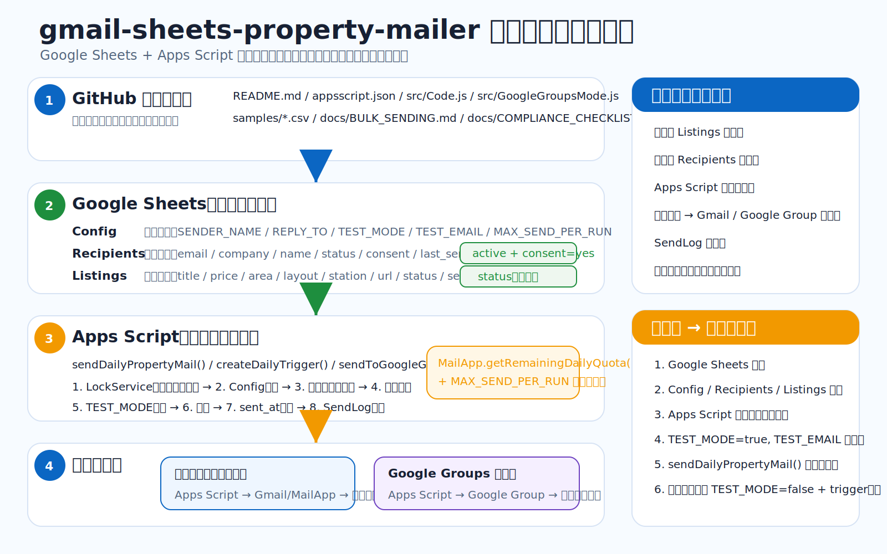

# gmail-sheets-property-mailer 全体アーキテクチャ

## 目的

Google Sheets を名簿・物件データベースとして使い、Google Apps Script から Gmail / MailApp で物件情報メールを送る最小構成です。

この構成は、無料枠での小規模検証・少量配信を前提にしています。大量配信、毎日 1,000 名以上への配信、到達率管理、バウンス処理、配信停止の自動化が必要な場合は、Google Sheets は管理 DB として残し、実送信部分だけ SendGrid / Amazon SES / Brevo / Mailchimp などのメール配信サービスへ移行してください。

## 主要コンポーネント

### GitHub リポジトリ

- `README.md`: 導入手順と概要
- `appsscript.json`: Apps Script の設定
- `src/Code.js`: 個別配信モードのメイン処理
- `src/GoogleGroupsMode.js`: Google Groups 宛て配信・メンバー管理補助
- `samples/*.csv`: Google Sheets 初期データ用サンプル
- `docs/*.md`: 大量配信・法務/到達率チェックリスト

### Google Sheets

- `Config`: 送信者名、返信先、テストモード、送信上限、配信停止文などを管理
- `Recipients`: 宛先、会社名、担当者名、ステータス、同意状態を管理
- `Listings`: 配信対象の物件情報を管理
- `SendLog`: 実行結果・スキップ理由・送信結果を記録
- `GroupImport` / `GroupRemoval`: Google Groups モード利用時の補助シート

### Apps Script

- `sendDailyPropertyMail()`: 個別配信モードのメイン処理
- `createDailyTrigger()`: 日次実行トリガーを作成
- `sendToGoogleGroup()`: Google Groups 宛てにまとめて送る処理
- `exportEligibleRecipientsForGoogleGroup()`: グループ追加用の宛先一覧を出力
- `exportStoppedRecipientsForGoogleGroupRemoval()`: 配信停止・バウンス対象の削除候補を出力
- `createWeeklyGoogleGroupTriggers()`: Google Groups モード用の曜日指定トリガーを作成

## 全体の処理の流れ

1. 物件を `Listings` に登録する。
2. 宛先を `Recipients` で管理する。
3. Apps Script が `Config`、`Recipients`、`Listings` を読み込む。
4. `status=active` かつ `consent=yes` の宛先だけを抽出する。
5. `Listings.status` が空欄の未送信物件だけを抽出する。
6. `TEST_MODE=true` の場合は `TEST_EMAIL` のみに送る。
7. `TEST_MODE=false` の場合は対象宛先へ送る。
8. 送信結果を `SendLog` に記録する。
9. 本番送信時は物件の `sent_at` や宛先の `last_sent_at` を更新する。
10. 次回実行時は未送信の物件だけを対象にする。

## 無料運用の考え方

無料 Gmail / Apps Script での運用は、小規模・検証用途に限定するのが安全です。

推奨設定:

- `TEST_MODE=true` で必ずテストする
- `MAX_SEND_PER_RUN=20` など小さい値から始める
- 配信許可がある相手だけに送る
- 配信停止文を本文に必ず入れる
- BCC 一括送信は使わない
- 送信ログを毎回確認する

## Google Groups モード

Google Groups モードは、Apps Script から Google Group のメールアドレスに 1 通送り、グループ参加メンバーに配信する方式です。

注意点:

- グループメンバー管理は自動追加・自動削除ではなく、`GroupImport` / `GroupRemoval` を使った手動補助です。
- テスト時は `GROUP_TEST_EMAIL` または `TEST_EMAIL` に送ります。
- 曜日指定配信が可能です。
- Google Groups の利用規約、投稿権限、メンバー追加ポリシーを必ず確認してください。
